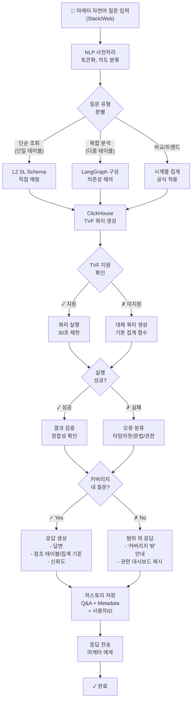
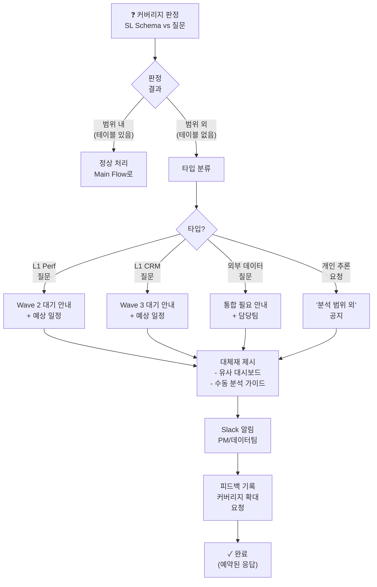
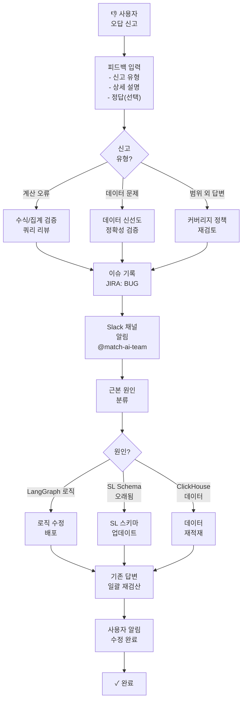
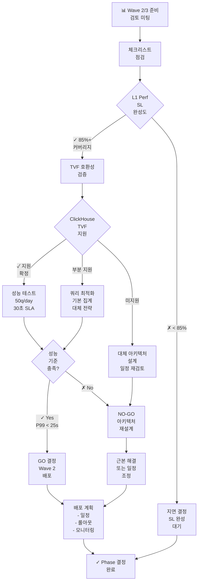

# MATCH AI Assistant Phase 1 — UX Logic & System Architecture

**Project**: MATCH AI Assistant Phase 1 — 29CM 마케팅기획팀 대상 AI 분석 어시스턴트
**Date**: 2026-03-31
**Version**: 1.0
**Owner**: ux-logic-analyst

---

## 1. 메인 플로우 (Main Flow: 자연어 질문 → 답변 반환)



---

## 2. 커버리지 외 처리 플로우 (Out-of-Scope Query Handling)



---

## 3. 피드백(오답 신고) 플로우 (Feedback & Error Reporting)



---

## 4. Wave 확장 판단 플로우 (Wave 2/3 Go-No Go Decision)



---

## 5. 시스템 정책 (System Policies)

### POL-001: 질문 처리 SLA
- **목표**: 자연어 질문 수신 후 답변 반환까지 **30초 이내**
- **범위**: 커버리지 내 질문 (L2 SL 포함)
- **예외**: ClickHouse 장애 시 → 캐시 답변 반환 (신선도 3시간 이상) + "데이터 신선도 3시간" 표시
- **모니터링**: P99 응답 시간 매일 대시보드 추적

### POL-002: 커버리지 내/외 명확화
- **커버리지 내**: Semantic Layer(L2) 테이블 + 정의된 집계 기준이 존재하는 질문
- **커버리지 외**: L1 Performance, L1 CRM, 미통합 데이터소스, 개인 주관적 분석
- **판정 주체**: LangGraph Schema Validator (자동) + 매월 PM 리뷰
- **정책**: 커버리지 외 답변 시 → "범위 밖입니다" 명시 + 관련 대시보드 제시 필수

### POL-003: 참조 메타데이터 표시
- **필수**: 모든 답변에 다음 포함
  - 참조 테이블명 (TVF 이름 또는 기본 테이블)
  - 집계 기준 (SUM/AVG/COUNT/기타)
  - 데이터 신선도 (마지막 갱신 시각)
  - 신뢰도 레벨 (High/Medium/Low)
- **예시**:
  ```
  📊 29CM 마케팅 ROI: 3.2배

  📌 근거:
  - 테이블: marketing_spend_v2 (L2), campaign_revenue_v2 (L2)
  - 집계: SUM(spend) / SUM(revenue)
  - 신선도: 2026-03-31 09:00 KST
  - 신뢰도: High (정규화된 공식)
  ```

### POL-004: 오류 분류 & 응답 전략
| 오류 타입 | 응답 전략 | 사용자 메시지 |
|---------|---------|-------------|
| **쿼리 타임아웃 (>30s)** | 캐시 답변 반환 | "⚠️ 데이터 신선도 3시간입니다" |
| **TVF 미지원** | 기본 집계 함수로 대체 | "기본 집계로 제공합니다" |
| **ClickHouse 연결 실패** | 캐시 답변 또는 오류 | "지금 일시적 오류. 대시보드 접속하세요" |
| **데이터 권한 부족** | 오류 | "이 데이터는 접근 권한이 없습니다" |
| **질문 문법 오류** | 재입력 가이드 | "질문을 다시 정리해주세요 예: '29CM ROI는?'" |

### POL-005: 피드백 처리 SLA
- **수신 → 분류**: 1시간 이내
- **근본 원인 분석**: 24시간 이내
- **조치 완료**: 중대도에 따라
  - **P0 (계산 오류)**: 4시간
  - **P1 (데이터 신선도)**: 24시간
  - **P2 (범위 외 안내)**: 1주일
- **사용자 알림**: 조치 완료 후 Slack 메시지

### POL-006: 히스토리 저장 & 조회
- **저장**: 모든 Q&A + Timestamp + UserID + 답변 신뢰도
- **보관 기간**: 6개월
- **조회 권한**: 본인 + PM + 데이터팀
- **활용**: 유사 질문 추천(P1), 학습 데이터
- **개인정보**: 질문 내용은 암호화 저장

### POL-007: Wave 확장 GO/NO-GO 기준
| 항목 | Go 기준 | No-Go 조건 |
|-----|--------|---------|
| **SL 완성도** | >= 85% | < 85% 테이블 커버리지 |
| **TVF 호환성** | >= 80% 쿼리 | < 80% 또는 핵심 쿼리 미지원 |
| **성능** | P99 < 25초 | P99 >= 25초 또는 가용성 < 99% |
| **Data Quality** | 신선도 <= 3시간 | 신선도 > 3시간 또는 정확도 < 95% |

### POL-008: 피드백 → 커버리지 확대 의사결정
- **월 1회 리뷰**: PM + 데이터팀
- **조건**: 월 3회 이상 동일 질문 피드백 → 커버리지 확대 검토
- **우선순위**: 마케팅 임팩트 높은 것부터
- **타임라인**: 승인 후 2주 내 구현 또는 큐 등록

---

## 6. Edge Cases & Error Handling

### EX-001: ClickHouse TVF 미지원 (핵심 기술 리스크)
| 항목 | 처리 방안 |
|-----|---------|
| **발생 조건** | ClickHouse Cloud 버전에서 특정 TVF 함수 미지원 |
| **감지 방법** | 쿼리 실행 시 구문 오류 "function not found" |
| **응답 전략** | 기본 SQL 집계로 자동 변환 (CASE WHEN 등) |
| **사용자 영향** | 투명 (사용자는 모름), 내부적으로만 최적화 |
| **모니터링** | 월 1회 호환성 테스트, ClickHouse 버전 업그레이드 시 재검증 |
| **Risk Level** | **P0 — 배포 전 필수 해결** |

---

### EX-002: 30초 타임아웃 발생
| 항목 | 처리 방안 |
|-----|---------|
| **발생 조건** | 복합 조인 쿼리, 대용량 데이터 스캔 |
| **감지 방법** | ClickHouse 응답 없음 > 30초 |
| **응답 전략** | <ul><li>캐시 답변 있으면: 반환 + "⚠️ 신선도 [시간]" 표시</li><li>캐시 없으면: "지금은 분석 중. 대시보드로 확인해주세요" |
| **재시도 로직** | 자동 재시도 1회 (다른 시점), 실패 시 오류 |
| **성능 최적화** | <ul><li>쿼리 분해 (여러 작은 쿼리로)</li><li>인덱스 확인</li><li>파티션 전략 검토</li></ul> |
| **Risk Level** | **P1 — Phase 1에서 모니터링** |

---

### EX-003: 데이터 신선도 불일치
| 항목 | 처리 방안 |
|-----|---------|
| **발생 조건** | L2 SL의 갱신 스케줄이 다름 (일부 일 1회, 일부 주 1회) |
| **감지 방법** | 메타데이터에서 last_updated 값 비교 |
| **응답 전략** | 가장 오래된 신선도를 기준으로 표시 |
| **예시** | 테이블A: 오늘 09:00 / 테이블B: 3일 전 → "신선도: 3일 전" |
| **사용자 가이드** | 답변 하단에 "신선도 [시간] — 더 최신 대시보드: [URL]" 안내 |
| **Policy** | 신선도 > 3시간이면 캐시 사용 불가, 수동 분석 권장 |
| **Risk Level** | **P2** |

---

### EX-004: 모호한 질문 (Ambiguous Query)
| 항목 | 처리 방안 |
|-----|---------|
| **발생 조건** | "ROI는?" (기간 미지정), "성과는?" (KPI 미지정) |
| **감지 방법** | NLP 확신도 < 70% 또는 여러 테이블 후보 매핑 |
| **응답 전략** | 명확화 질문 제시 + 템플릿 제안 |
| **예시** | <blockquote>질문이 명확하지 않습니다. 다음 중 선택해주세요:<br/>- "3월 29CM ROI는?"<br/>- "전사 마케팅 ROI는?"<br/>- "캠페인별 ROI 비교"</blockquote> |
| **Template 제시** | 카테고리별 사전 정의 템플릿 노출 (P1) |
| **Risk Level** | **P2 — 사용자 경험 개선** |

---

### EX-005: 커버리지 경계선 (Boundary Case)
| 항목 | 처리 방안 |
|-----|---------|
| **발생 조건** | "L1 Performance 테이블이 있는데 SL에 없음" (Wave 2 구간) |
| **감지 방법** | 스키마 비교: DB 테이블 존재 but SL 정의 없음 |
| **응답 전략** | "Wave 2 준비 중입니다. 예상 일정: 2026-04-XX" |
| **임시 솔루션** | PM 수동 분석 가능 → "별도 분석이 필요합니다. PM 요청: [JIRA]" |
| **모니터링** | Wave 진행도 추적, SL 완성도 주간 리뷰 |
| **Risk Level** | **P1** |

---

### EX-006: 권한 (Authorization) 오류
| 항목 | 처리 방안 |
|-----|---------|
| **발생 조건** | 사용자가 특정 데이터셋 접근 권한 없음 |
| **감지 방법** | ClickHouse 인증 오류 |
| **응답 전략** | "이 데이터에 접근 권한이 없습니다. 데이터팀 요청: [URL]" |
| **Self-Service** | 권한 요청 링크 자동 제시 |
| **기록** | 권한 요청 기록 → 월 리뷰 (자주 요청되는 데이터 파악) |
| **Risk Level** | **P2 — 보안 관련** |

---

### EX-007: 오답 신고 후 재발
| 항목 | 처리 방안 |
|-----|---------|
| **발생 조건** | 동일 질문에 대해 2회 이상 오답 신고 |
| **감지 방법** | 피드백 기록 분석 |
| **응답 전략** | <ul><li>즉시 해당 질문 타입 차단 (답변 반환 중지)</li><li>수동 검토 완료까지 "현재 점검 중" 응답</li><li>PM + 데이터팀 긴급 미팅</li></ul> |
| **재배포** | 근본 원인 해결 후 베타 테스트 후 재배포 |
| **신뢰도 관리** | 신뢰도 점수 즉시 Low로 하향 |
| **Risk Level** | **P0 — 긴급** |

---

### EX-008: ClickHouse 클러스터 장애
| 항목 | 처리 방안 |
|-----|---------|
| **발생 조건** | ClickHouse Cloud 서비스 불가 (장애 > 5분) |
| **감지 방법** | 연속 3회 연결 실패 |
| **응답 전략** | <ul><li>Slack 자동 알림 (#match-ai-ops)</li><li>사용자 응답: "일시적 오류. 대시보드 직접 접속해주세요"</li><li>유사 히스토리 있으면 캐시 반환</li></ul> |
| **장애 중 동작** | 질문 수락 → 큐 적재 → 복구 후 일괄 처리 |
| **SLA** | 30분 내 복구, 초과 시 PM 통보 |
| **Risk Level** | **P0 — 시스템 가용성** |

---

## 7. 추가 정책 및 고려사항

### 모니터링 & 관찰 지표 (Observability)
- **응답 시간**: P50, P95, P99 분포
- **오류율**: 타입별 오류 건수
- **캐시 히트율**: 캐시 반환 비율
- **사용자 만족도**: 오답 신고율
- **커버리지**: 월간 내/외 질문 비율

### 롤아웃 전략
1. **Beta (1주)**: PM 5명 테스트
2. **Canary (1주)**: 29CM 마케팅팀 30% (일부 팀)
3. **GA (1주)**: 29CM 마케팅팀 100%
4. **각 단계별**: 오답 신고율 < 5% 기준으로 진행

### 추후 개선 (P1/P2)
- REQ-008: 히스토리 유사 질문 추천 (임베딩 기반)
- REQ-009: 관련 대시보드 링크 (메타 매핑)
- REQ-010: 비교 분석 (다중 차원)
- REQ-011: 캐시 + 신선도 (이미 포함)

---

## 8. 참고: 정책 참조 매트릭스

| 요구사항 | 담당 정책 | Mermaid 위치 |
|--------|---------|----------|
| REQ-001 | POL-001 (SLA) | Main Flow |
| REQ-002 | POL-003 (메타데이터) | Main Flow |
| REQ-003 | POL-002 (커버리지) | Out-of-Scope Flow |
| REQ-004 | POL-005 (피드백 SLA) | Feedback Flow |
| REQ-005 | EX-004 (모호한 질문) | Main Flow |
| REQ-006 | POL-006 (히스토리) | Main Flow |
| REQ-007 | POL-007 (Wave GO) | Wave Expansion Flow |
| REQ-008-011 | 추후 개발 | N/A |

---

**Document End**
