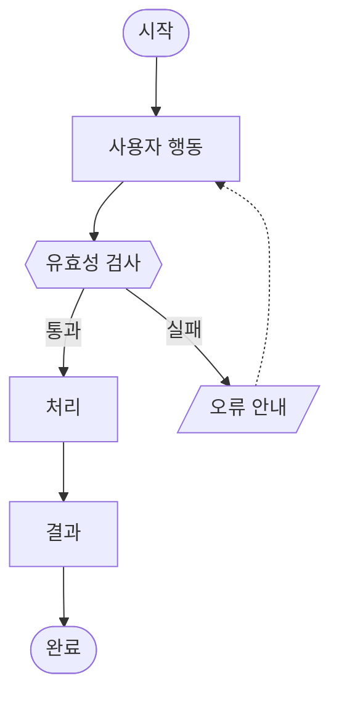

# 표준 PRD 템플릿 (Confluence 양식 기준)

## 사용 방법

이 템플릿은 PRD Builder Agent가 최종 PRD를 작성할 때 구조 기준으로 사용한다.
`{중괄호}` 부분을 실제 내용으로 채우고, 해당 없는 항목은 "{미정}"으로 표기한다.

> 완성형 참고: https://wiki.team.musinsa.com/wiki/spaces/membership/pages/361367187/PRD+29CM+Phase+1-A

---

## Phase → 섹션 매핑 (에이전트 참조용)

| Phase | 채우는 PRD 섹션 |
|-------|--------------|
| Phase 0 / 0.5 | (1) 배경 및 문제 — Pain Point, 핵심 질문 |
| Phase 1 (전략 수립) | (1) 배경 및 문제 + (2) 목표 / Business Impact + (3) High Level Solution |
| Phase 2a (requirement-writer) | (4-2) Functional Requirements + (4-3) Non-Functional Requirements |
| Phase 2b (ux-logic-analyst) | (4-1) User Flow + (5) 상세 정책 |
| Phase 2.5 (diagram-generator) | (4-1) User Flow 다이어그램 렌더링 |
| Phase 3 (Self-Review) | 전체 통합 + (7) 실행 계획 + Open Questions |
| Phase 4/5 (Red Team 보강) | 전체 섹션 보강 코멘트 삽입 |

---

# [{YYYYMM}] {기능명} PRD

| **Version** | **날짜** | **상세** |
|-------------|---------|---------|
| 1.0 | {YYYY-MM-DD} | 최초 작성 |

| **2-Pager** | {2-Pager Confluence URL 또는 {미정}} |
|-------------|-------------------------------------|
| **Initiatives** | {Jira Initiative 키 또는 {미정}} |

| **구성원** | PM | {PM 이름} |
|-----------|-----|----------|
| | Design | {디자이너 이름 또는 {미정}} |
| | Dev | FE: {이름} / BE: {이름} / MLE: {이름 또는 해당없음} |
| | QA | {QA 담당자 또는 {미정}} |
| | 마케팅 | {마케팅 담당자 또는 해당없음} |
| **Milestone** | 개발: {날짜} / QA: {날짜} / 정상 운영: {날짜} |

---

# (1) 배경 및 문제

{현재 사용자가 겪고 있는 문제 또는 놓치고 있는 기회를 2~3문장으로 서술.
데이터나 사용자 인터뷰 근거가 있으면 함께 포함.}

### Pain Point

| **#** | **Pain Point** | **구조적 원인** | **비즈니스 영향** |
|-------|--------------|--------------|----------------|
| 1 | {Pain Point 명} | {근본 구조 원인} | {KPI 또는 운영 영향} |
| 2 | {Pain Point 명} | {근본 구조 원인} | {KPI 또는 운영 영향} |

### 용어 정의

> 이 문서에서 사용하는 핵심 용어를 정의한다. 독자가 도메인 전문가가 아닐 수 있음을 전제로 작성.

| 용어 | 정의 |
|------|------|
| {용어} | {정의} |

**해결하려는 핵심 질문:**
> {이 기능을 통해 답하려는 비즈니스 또는 사용자 질문.
> 예: "왜 첫 구매 후 30일 내 재구매율이 낮은가?"}

---

# (2) 목표 / Business Impact

## 2-1. 목표

### Scope

#### 이번 Phase 포함 범위

- {포함 항목 1}
- {포함 항목 2}

#### 비포함 범위 (Non-Goals)

- {제외 항목 1}: {제외 이유}
- {제외 항목 2}: {제외 이유}

## 2-2. Business Impact

> {비즈니스 요약 한 줄 — "이 기능이 성공하면 어떤 상태가 되는가"}

| **Metrics** | **Hierarchy** | **Baseline** | **Target Goal** | **집계 방식** |
|-------------|---------------|-------------|----------------|-------------|
| {지표명} | North Star | {현재 수치 + 기준일} | {목표값 (기간 포함)} | {GA4 / Amplitude / Databricks 등} |
| {지표명} | Primary | {현재 수치} | {목표값} | |
| {지표명} | Primary | {현재 수치} | {목표값} | |
| {지표명} | Guardrail | {현재 수치} | {허용 한계선 (초과 금지)} | |

> **Baseline 없을 경우**: Amplitude 또는 Databricks에서 수집 후 기재. 수집 불가 시 "{OQ-B01 — Baseline 확인 필요}"로 표기.

---

# (3) High Level Solution

{기능의 전체 방향성을 1~3문단으로 서술.
구현 방법(How)이 아닌 접근 방식(Approach)과 핵심 아이디어를 기술.}

---

# (4) 상세 기획

## 4-1. User Flow

> 주요 사용자 시나리오별 플로우 명시

> **플로우 테이블** — 각 단계 상세 설명

| **No.** | **시점** | **작업** | **상세 내용** |
|---------|---------|---------|-------------|
| 1 | {시점} | {작업명} | {상세} |

## 4-2. Functional Requirements

> - 기능별 상세 요구사항 → 구현 방법은 언급하지 않고 기능의 존재 여부에 집중
> - "사용자가 X하면 시스템은 Y한다" 형태로 작성
> - **수용 기준(AC)은 반드시 Given/When/Then 형식으로 작성**
> - Input / Output / 비즈니스 규칙 / 시스템 인터페이스 명시
> - "엔지니어와 협의", "추후 결정", "TBD" 표현 금지

### [A] {서브시스템명 — 예: 소재 등록}

| ID | 요구사항 | 수용 기준 |
|----|---------|---------|
| A-001 `p0` | **[기능명]** {사용자가 X하면, 시스템은 Y한다.} **Input:** {입력값} **Output:** {출력값} **비즈니스 규칙:** {규칙 목록} **시스템 인터페이스:** {A → B → C 방향} | **Given:** {초기 상태 — 구체적 수치/역할/상태 포함} **When:** {트리거} **Then:** - {기대 결과 1} - {기대 결과 2} |
| A-002 `p1` | ... | ... |

### [B] {서브시스템명}

| ID | 요구사항 | 수용 기준 |
|----|---------|---------|
| B-001 `p0` | ... | ... |

> **P0/P1/P2 기준**
> - `p0`: 이 기능 없이는 제품이 의미 없다 (필수)
> - `p1`: 있으면 좋지만 없어도 서비스 가능 (향상)
> - `p2`: 이후 Phase 대상 (범위 외)
> - `비개발`: 스프레드시트 함수, 운영 정책 등 개발 없이 처리

### 범위 외 (Out of Scope)

| 항목 | 제외 이유 |
|------|---------|
| {제외 기능} | {이유} |

## 4-3. Non-Functional Requirements

| **항목** | **요구사항** | **기준** |
|---------|------------|--------|
| 응답 속도 | {응답 시간, 처리량 등} | {구체적 수치} |
| 보안 | {인증, 권한, 데이터 보호} | {기준} |
| 가용성 | {업타임, 장애 복구} | {기준} |
| 피크 트래픽 | {대규모 요청 처리} | {기준} |

---

# (5) 상세 정책

## 5-1. 정책 상세

> 시스템 관점에서 "어떤 규칙으로 동작해야 하는가" 정의

| **ID** | **조건** | **시스템 동작** |
|--------|---------|--------------|
| POL-001 | {구체적 조건} | {명확한 시스템 동작 — 모호한 표현 금지} |
| POL-002 | {조건} | {동작} |

## 5-2. Edge Cases & Error Handling

> 정상 플로우 외에 예외 상황을 어떻게 처리할지를 정의

| **ID** | **발생 조건** | **예상 영향** | **처리 방안** |
|--------|------------|------------|-------------|
| EX-001 | {발생 조건} | {영향} | {처리 방안 — 사용자 메시지 + 시스템 행동 포함} |

---

# (6) 디자인 링크

| 항목 | 링크 |
|------|------|
| Figma (와이어프레임) | {URL 또는 {미정}} |
| Figma (디자인 시안) | {URL 또는 {미정}} |
| 프로토타입 | {URL 또는 해당없음} |

---

# (7) 실행 계획

## 7-1. Phased Approach & Timeline

| # | 마일스톤 | 담당 | 시작일 | 완료 목표일 | 상태 | 블로커 |
|---|---------|------|------|-----------|------|------|
| M1 | {마일스톤 내용} | {담당 역할} | {날짜} | {날짜} | ⚫ | — |
| M2 | {마일스톤 내용} | {담당 역할} | {날짜} | {날짜} | ⚫ | — |

> ⚫ Not Started / 🟡 In-Progress / 🟢 Completed

### 의존성 및 리스크

| 항목 | 내용 | 영향도 |
|------|------|--------|
| {의존 팀/시스템} | {의존 내용} | 높음/중간/낮음 |

## 7-2. Launch & Rollout Plan

{론칭 방식 및 단계적 배포 전략 서술. A/B 테스트, 피처 플래그, 단계별 트래픽 확대 포함.}

## 7-3. Open Questions

> 결정 불가하여 PRD에 포함하지 못한 사항만 기록.
> 각 항목은 구체적 질문 형식 + 담당자 + 마감일 + 영향 섹션.

| # | 질문 (구체적 형식) | 담당자 | 마감일 | 결정 시 영향 섹션 |
|---|-----------------|--------|--------|----------------|
| OQ-001 | {~를 어떻게 처리할까? / ~의 기준값은 얼마로 할까?} | {담당자} | {날짜} | {AC ID 또는 섹션명} |

## 7-4. 작업 시 주의사항

> 선행 조건, 인프라 연동 리스크, 외부 팀 의존성 등 개발 착수 전 반드시 확인해야 할 사항

{인프라 연동, 외부 팀 의존성, 선행 완료 필요 조건 등 주의사항 서술.
플랫폼 PRD의 경우 API Contract, 스키마 설계, 네트워크 연동 등 선행 작업 목록 포함.}

---

# (8) Appendix

## 8-1. 참고 데이터

{현황 데이터, Amplitude/Databricks 조회 결과, 계절성 보정 여부 등 기재.
Baseline이 이 섹션에서 추출된 경우 원본 쿼리 또는 조회 조건 포함.}

| 항목 | 수치/내용 | 출처 | 기준일 |
|------|---------|------|------|
| {지표명} | {수치} | {Amplitude / GA4 / Databricks} | {YYYY-MM} |

## 8-2. 관련 문서

| 항목 | 링크 |
|------|------|
| 2-Pager | {URL} |
| 관련 Confluence 문서 | {URL} |
| 참고 스프레드시트 | {URL} |

---

*이 문서는 PRD Builder Agent에 의해 자동 생성되었습니다. ({생성 날짜})*
